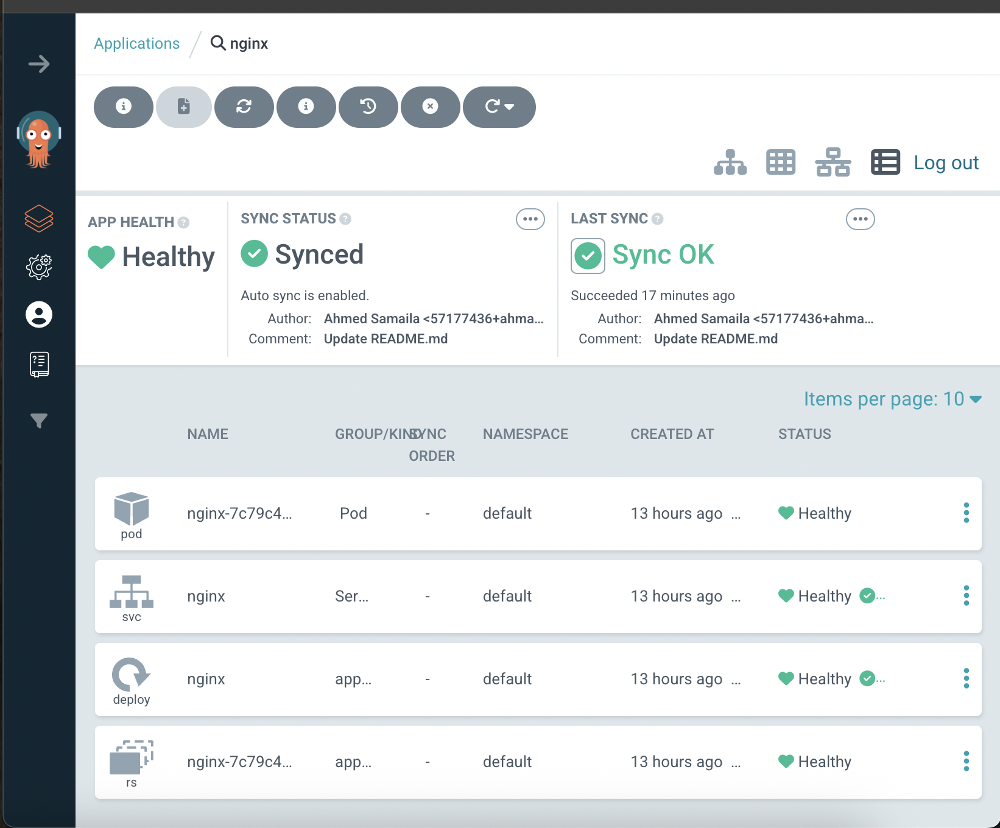

# 🚀 nginx-argo-app

This repository contains a basic Kubernetes deployment of the **NGINX web server** using **Kustomize**.  
It is designed for **GitOps-based delivery** using **Argo CD**.

---

## 📁 Files Included

- `deployment.yaml` – Defines the NGINX Deployment
- `service.yaml` – Exposes the NGINX deployment using ClusterIP
- `kustomization.yaml` – Combines both files using Kustomize

---

## ✅ Prerequisites

To deploy this application using Argo CD:

- A running Kubernetes cluster (e.g. Minikube, Kind, or cloud-managed)
- Argo CD installed 
- `kubectl` and optionally `kustomize` for local testing

---

## 🚀 How to Deploy (via Argo CD)

1. Add the Git repo to Argo CD:
   ```bash
   argocd repo add https://github.com/ahmadu2305/nginx-argo-app.git

	2.	Create the app:

argocd app create nginx-argo-app \
  --repo https://github.com/ahmadu2305/nginx-argo-app.git \
  --path . \
  --dest-server https://kubernetes.default.svc \
  --dest-namespace default \
  --sync-policy automated --self-heal


	3.	Sync the app:

argocd app sync nginx-argo-app


⸻


## 📸 Screenshot



🔖 GitHub Topics

This project uses the following topics:
argo-cd, gitops, nginx, kustomize, kubernetes, devops

⸻

🤝 Contributing

Contributions are welcome!
If you’d like to improve this project, feel free to:
	•	Fork the repository
	•	Create a new branch
	•	Commit your changes
	•	Open a pull request (PR)

Please ensure your changes follow best practices and are tested when appropriate.

⸻

📄 License

This project is licensed under the MIT License – see the LICENSE file for details.

⸻

👤 Maintainer

Ahmed Samaila
Yayyafi Global Resources
📫 Email: ahmed@yayyafi.com

⸻

🌟 Acknowledgments
	•	Built with ❤️ using Argo CD and Kubernetes
	•	Supported by the Cloud Native and open source community

⸻
